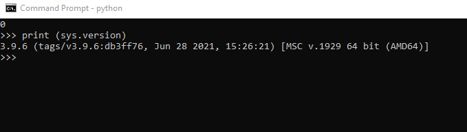
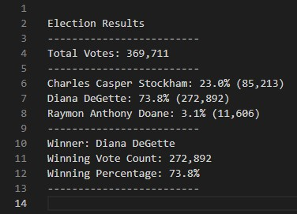

# Election_Analysis

## Project Overview
The project's purpose is to conduct an audit of the data collected for the voting results in Colorado. The  Colorado Board of Elections needs to get the details for the following points:

    - Total number of votes cast
    - A complete list of candidates who received votes
    - Total number of votes each candidate received
    - Percentage of votes each candidate won
    - The winner of the election based on popular vote

## Resources 
- Data source: [election_results.csv](Resources/election_results.csv)
- Softwate: Python 3.9.6 (tags/v3.9.6:db3ff76, Jun 28 2021, 15:26:21) [MSC v.1929 64 bit (AMD64)] 

## Summary

For this purpose, we use Python. Using some functions such as reading and writing files, calculations, and applying formats for the terminal and for text files, we obtained the following results:

- 369,711 people voted.
- Three candidates participated, Diana DeGette obtained an almost absolute majority with 73.8% of the total votes.
- Not even adding the results of the other 2 participants could they even come close.
- Raymon Anthony Doane has to work hard on increasing his reach to voters, he only got 3.1%.

Resume.

* There were 369,711 votes cast in the election.
* The three candidates were:
    * Charles Casper Stockham
    * Diana DeGette
    * Raymon Anthony Doane
* The candidate results were:
    * Charles Casper Stockham received 23.0% of the vote and 85,213 number of votes.
    * Diana DeGette received 73.8% of the vote and 272,892 number of votes.
    * Candidate 3 received 3.1% of the vote and 11,606 number of votes.
* The winner of the election was:
    * Diana DeGette, who received 73.8% of the vote and 272,892 number of votes.

## Challenge Overview
## Challenge Summary

